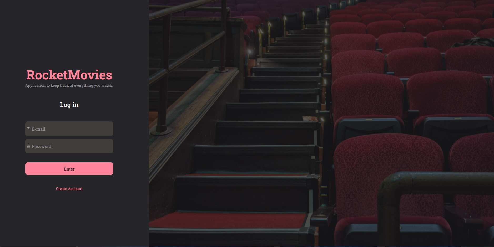
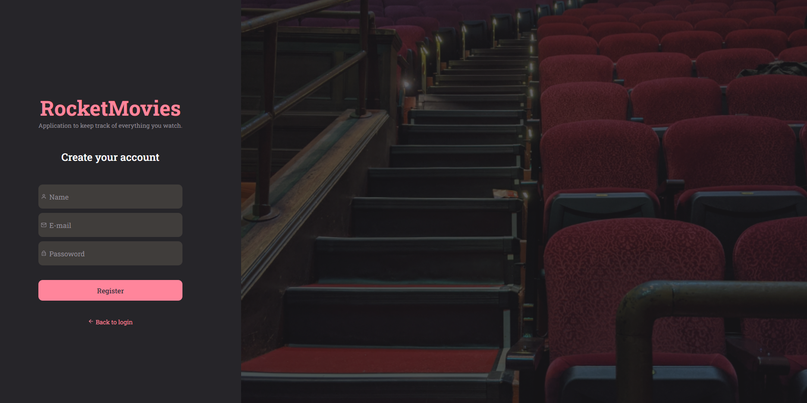
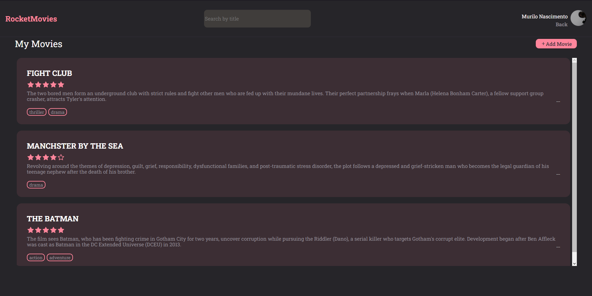
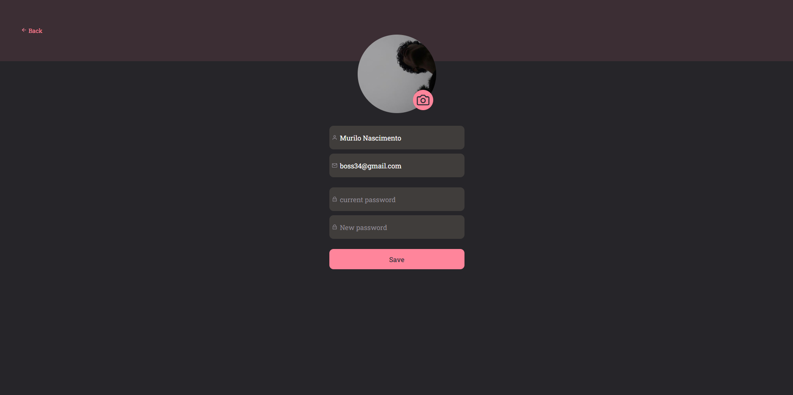

<h1 align="center"> Project - Rocket Movies 📽🚀</h1>

<p align="center">
Time to put into practice what was taught in the first phase of stage 09 and what was seen in the previous stages.

<p align="center">
  <a href="#-Technologies">Technologies</a>&nbsp;&nbsp;&nbsp;|&nbsp;&nbsp;&nbsp;
  <a href="#-Project">Project</a>&nbsp;&nbsp;&nbsp;|&nbsp;&nbsp;&nbsp;
  <a href="#-Layout">Layout</a>&nbsp;&nbsp;&nbsp;|&nbsp;&nbsp;&nbsp;
  <a href="#memo-license">license</a>
</p>

<p align="center">
  
</p>

<br>

## 🚀 Technologies used in the project

It was produced with the following

&nbsp;
&nbsp;
&nbsp;


## 💻 Project
This project is the visual part of an application for saving, viewing, editing, and deleting movies from a database.

## 🔖 Project Layout
Page from SignIn

<br>
<br>
Page from SignUp

<br>
<br>
Home Page

<br>
<br>
Profile Page

<br>
<br>
Create Movie Page

<br>
<br>
Movie Preview


<br>
 Rocket link: 
<br>
https://efficient-sloth-d85.notion.site/Front-end-da-aplica-o-30a5132b30534255b238a8aa1b48c963

<br>

## Apprenticeship

- **ReactJS** - used to build the interfaces;
- **JS** - used to make all the application logic;
- **Styled Components** - used to do the styling;
- **Git** - responsible for versioning the code.
- **Axios** - used to make requests.
- **Vite** - used to create a React project;
- **NPM** - used to install dependencies;

<br>
<br>

## :bulb: Utilização

- Start by cloning the project:

```bash
  $ git clone git@github.com:MvriloNascimento/Stage09-RocketMovies.git
```

- Enter the directory:

```bash
  $ cd rocketmovies-frontend/
```

- Install dependencies:

```bash
  $ npm install
```

- Start a local server:

```bash
  $ npm run dev
```

- If everything goes well, you will receive a message similar to this:

```bash
 VITE v4.2.1  ready in 686 ms

  ➜  Local:   http://localhost:5173/
  ➜  Network: use --host to expose
  ➜  press h to show help
```

- Now open your browser at the address entered in "`Local`" to test the application.


## Website
 - WILL BE ADDED IN THE FUTURE
---


